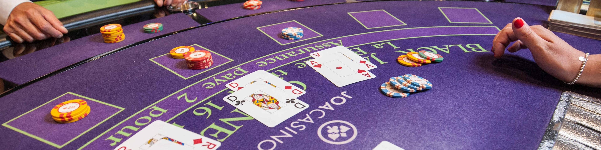
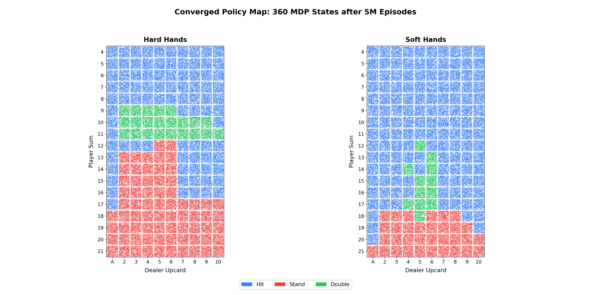

<p align="center">
  
</p>

## Project rationale

The code plays 5 million hands of blackjack, starting from every possible situation. After each hand it updates its estimate of how good each decision was. Over millions of episodes, it learns when to hit, stand, or double down for every combination of player hand, dealer upcard, and ace status. The result is a color-coded policy map covering all 360 states, which can be checked against published basic strategy tables derived from exact probability calculations.

# Monte Carlo Reinforcement Learning for Optimal Blackjack Strategy

A from-scratch implementation of **Monte Carlo Exploring Starts** (Sutton & Barto 2018, Section 5.3) applied to casino Blackjack. The agent learns an optimal policy over 5 million episodes by iteratively updating action-value estimates $Q(s,a)$ through first-visit returns, converging to the optimal hit/stand/double policy for the full 360-state space.

## What the project finds

After 5 million training episodes, the agent discovers the optimal hit/stand/double policy for all 360 player states. The learned strategy closely matches published basic strategy charts derived from exact probability calculations.

<p align="center">
  
</p>

Key results:
- **Hard hands**: the agent learns to stand on 17+ regardless of dealer upcard, hit on 12-16 against dealer 7+, and stand on 12-16 against dealer 2-6
- **Soft hands**: the agent learns to hit soft 17 and below, stand on soft 19+, and double on favorable soft totals against weak dealer upcards
- **Doubling**: the agent identifies doubling opportunities on hard 10-11 against most dealer upcards, and selectively on soft hands

Estimated game value under the learned policy: **-0.037** (a 3.7% house edge). This is consistent with the simplified ruleset: naturals pay 1:1 instead of 3:2, no splitting, no insurance, no surrender. Under standard 3:2 rules with splitting, the house edge is closer to 0.5%.

## MDP formulation

The environment is a finite Markov Decision Process $(S, A, P, R, \gamma)$:

**State space** $S$: Each state is a tuple $(p, d, u)$ where $p \in \{4, 5, \ldots, 21\}$ is the player's hand total, $d \in \{1, 2, \ldots, 10\}$ is the dealer's visible card, and $u \in \{0, 1\}$ indicates whether the player holds a usable ace. This gives $|S| = 18 \times 10 \times 2 = 360$ states.

**Action space** $A = \{\text{Hit}, \text{Stand}, \text{Double}\}$: Three actions at each decision point. Doubling draws exactly one card and doubles the wager.

**Reward function** $R$:

$$R(s, a, s') = \begin{cases} +1 & \text{player wins} \ -1 & \text{dealer wins} \ 0 & \text{draw or non-terminal} \end{cases}$$

For double-down actions, the terminal reward is scaled by 2.

**Transition dynamics** $P(s' | s, a)$: Determined by the infinite-deck card distribution. Each drawn card is sampled uniformly from $\{1,2,\ldots,10,10,10,10\}$. Dealer follows a fixed policy: hit until reaching 17+, stand on soft 17.

**Discount factor**: $\gamma = 1$ (episodic, undiscounted).

**Value update** (first-visit Monte Carlo):

$$Q(s, a) \leftarrow Q(s, a) + \frac{1}{N(s,a)} \left[ G - Q(s, a) \right]$$

where $G$ is the episode return and $N(s,a)$ is the visit count.

## How it works

**1. Environment simulator (`blackjack_env.py`)**
Models Blackjack as a Markov Decision Process with state (player_sum, dealer_showing, usable_ace). Uses an infinite deck (cards drawn with replacement), dealer stands on soft 17, and three player actions: hit, stand, double. Naturals (two-card 21) are resolved immediately for both player and dealer.

**2. Monte Carlo RL agent (`mc_agent.py`)**
Implements Monte Carlo Exploring Starts. Each episode begins with a uniformly random first action to guarantee exploration of all state-action pairs. After the first step, the agent follows its current greedy policy. At the end of each episode, it computes the return G and performs an incremental mean update to Q(s,a) for every first-visited state-action pair. The greedy policy is then updated: pi(s) = argmax_a Q(s,a).

**3. Policy visualization (`solve.py`)**
Trains the agent for 5M episodes, then extracts the learned policy as two 18x10 matrices (hard hands and soft hands). Generates a dust-style converged policy map showing the action distribution across all 360 states.

## Project structure

```
rl-blackjack-solver/
    blackjack_env.py      # Blackjack MDP: states, transitions, rewards
    mc_agent.py           # Monte Carlo ES agent with Q-table
    solve.py              # training loop, plot generation
    requirements.txt      # numpy, matplotlib, seaborn
    results/
        policy_map.png         # dust-style converged policy map
        blackjack_banner.jpg   # header image
```

## Running

```bash
pip install -r requirements.txt
python solve.py
```

Training takes a few minutes for 5M episodes. Results are saved to `results/`.

## References

1. Sutton, R. S. & Barto, A. G. (2018). *Reinforcement Learning: An Introduction* (2nd ed.). MIT Press. Chapter 5: Monte Carlo Methods.

2. Thorp, E. O. (1962). *Beat the Dealer: A Winning Strategy for the Game of Twenty-One*. Random House.

3. Kaelbling, L. P., Littman, M. L., & Moore, A. W. (1996). "Reinforcement Learning: A Survey." *Journal of Artificial Intelligence Research*, 4, 237-285.

## License

MIT License. See [LICENSE](LICENSE).
